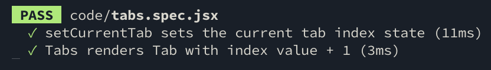
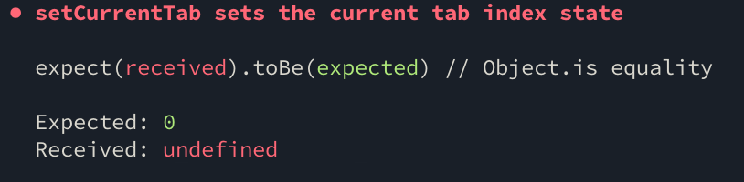
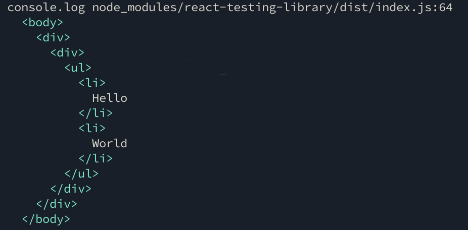

import './run'
import {Head, Appear} from 'mdx-deck'
import {Split, SplitRight} from 'mdx-deck/layouts'
import {
  CodeLayout,
  SplitCodeLayout,
  HorizontalSplit,
} from './components/layouts'
import {Tabs} from './code/tabs.js'
import {contents} from './code/contents'
import {CodeBlock} from './components/code-block'

export {default as theme} from './theme'

<Head>
  <title>react-testing-talk</title>
</Head>

# react-testing-talk

`github.com/with-heart/react-testing-talk`

---

## topics

- component thinking
- what not to test
- what to test
- how to test it
- `react-testing-library`

---

> `the more your tests resemble the way your software is used, the more confidence they can give you`

the `react-testing-library` guiding principle

---

## learn to think like a user

```notes
- developers think about engineering aspect
- easy get lost in details but they're implementation details
- painted huge picture without ever asking 'what does the user need?'
```

---

# 🤔

- what outcome do i want to achieve?
- what do i interact with to achieve that outcome?

```notes
- seems so simple
- how often do we slow down and think about things in this way
```

---


---

export default Split


### interactions

- select account from dropdown
- type password
- click 'Next'

---

export default Split


### implementation details

- account list loading/storage
- password value storage
- password field validation method
- 'Next' api call

---

## `interactions are public`

## implementation is private

---

## why shouldn't we test implementation details?

- false negatives: can break when you refactor
- false positives: may not fail when you break app code

---

export default Split

<CodeBlock code={require('!raw-loader!./code/tabs.js')} />

<Tabs contents={contents} />

---

export default SplitCodeLayout

<CodeBlock code={require('!raw-loader!./code/tabs.js')} />
<CodeBlock code={require('raw-loader!./code/__tests_enzyme__/tabs.spec.jsx')} />

---

export default HorizontalSplit

<Tabs contents={contents} />



---

export default Split

## false negative when refactoring

<CodeBlock code={require('!raw-loader!./code/tabs.refactor.js')} />

---

import {Tabs as RefactorTabs} from './code/tabs.refactor'

export default HorizontalSplit

<RefactorTabs contents={contents} />



---

export default Split

<CodeBlock
  code={require('raw-loader!./code/__tests_enzyme__/tabs.refactor.spec.jsx')}
/>


---

export default SplitRight

## and now for a false positive

<CodeBlock code={require('!raw-loader!./code/tabs.false-positive.js')} />

---

import {Tabs as FalsePositiveTabs} from './code/tabs.false-positive.js'

export default HorizontalSplit

<FalsePositiveTabs contents={contents} />


---

## so what's a `better` way to do this?

---

## `react-testing-library`

<Appear>bet you didn't see that coming</Appear>

---

## exposes methods and utilities that encourage you to write tests that resemble how your React components are `used`

---

## utilities principles

1. deals with DOM nodes rather than component instances
2. useful for testing individual React components or full React applications
3. implementations and APIs should be simple and flexible

---

<CodeBlock code={`import {render, fireEvent} from 'react-testing-library'`} />

---

## `render` takes jsx, renders it to DOM, and returns set of utilities targeting rendered output

---

## `fireEvent` fires events on DOM nodes

---

export default SplitCodeLayout

<CodeBlock code={require('!raw-loader!./code/tabs.js')} />

<CodeBlock code={require('raw-loader!./code/tabs.spec.jsx')} />

---

## `debug`

displays the rendered DOM output

---

export default Split

<CodeBlock code={require('!raw-loader!./code/debug.spec.js')} />



---

## `getByLabelText`

encourages form accessibility by targeting DOM node associated with label

---

<CodeBlock code={require('!raw-loader!./code/password.js')} />

---

import {Password} from './code/password'

<Password onSubmit={({password}) => alert(`Your password is: ${password}!`)} />

---

export default CodeLayout

<CodeBlock code={require('!raw-loader!./code/password.spec.js')} />

---

## `rerender`

re-renders a component with new props and points existing utilities to new node

---

export default CodeLayout

<CodeBlock code={require('!raw-loader!./code/max.spec.js')} />

---

## how do we test a `component class` method that handles logic?

---

export default CodeLayout

<CodeBlock code={require('!raw-loader!./code/logic.class.js')} />

---

## `don't`

---

export default CodeLayout

<CodeBlock code={require('!raw-loader!./code/logic.sfc.js')} />

---

## `externalize` as much logic as possible

focus your components on visual output. just use javascript for the rest

---

## `mocking` things

for external input the component output relies on, like the result of an api call

---

export default CodeLayout

<CodeBlock code={require('!raw-loader!./code/stuff.js')} />

---

import {Stuff} from './code/stuff'

<Stuff />

---

export default CodeLayout

<CodeBlock code={require('!raw-loader!./code/stuff.spec.js')} />

---

export default CodeLayout

<CodeBlock code={require('!raw-loader!./code/stuff.mock.js')} />

---

export default CodeLayout

<CodeBlock code={require('!raw-loader!./code/stuff.result.js')} />

---

export default CodeLayout

<CodeBlock code={require('!raw-loader!./code/stuff.error.js')} />

---

## testing `Context`

---

export default CodeLayout

<CodeBlock code={require('!raw-loader!./code/context.js')} />

---

export default CodeLayout

<CodeBlock code={require('!raw-loader!./code/context.spec.js')} />

---

export default CodeLayout

<CodeBlock code={require('!raw-loader!./code/context.tooling.spec.js')} />

---

## `i'm all out of content rn`

check out `github.com/paypal/downshift` for complex examples

---

## made with `mdx-deck`

<https://github.com/jxnblk/mdx-deck>
